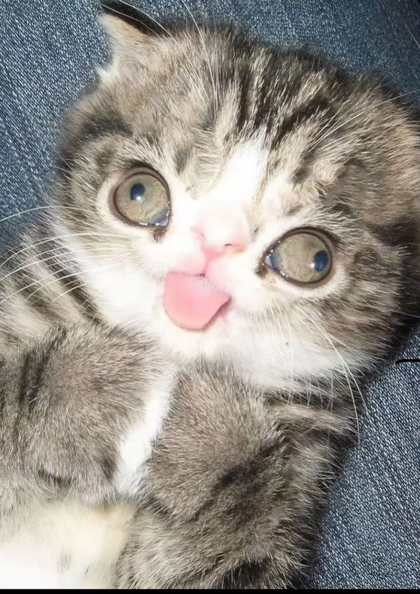

🐾 Albert

I don’t really know why I’m writing this here on my GitHub profile. Maybe this isn’t the place for such words, but I still want to leave a few lines about something that matters to me. Cats are fascinating creatures that have walked alongside humans for thousands of years. They can sleep up to sixteen hours a day 😴, and spend the rest of their time exploring the world and showing their independence. Scientists even claim that their purring has a healing effect: reducing stress and helping the body recover. ✨

Every cat is different: some are calm and affectionate, others curious and playful 🐾. Yet all of them bring comfort and have a strange ability to make any place feel like home. In ancient Egypt they were considered sacred animals, protectors of the household. 🏺 Today they’ve become family members, sources of warmth and joy. Sometimes I feel that in their grace and calmness lies the kind of harmony I want to find in both life and work.

And maybe now is the moment to confess: I’m just 17, and already diving deep into the world of frontend. Writing code for me is a lot like observing cats. Both require patience, attention, and a quiet fascination with how small details shape the bigger picture. 🐈‍⬛

  

